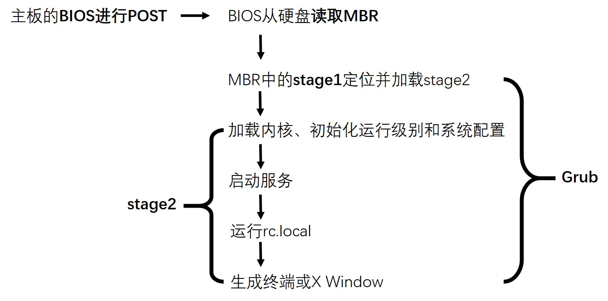

```{r setup, include=FALSE}
knitr::opts_chunk$set(echo = TRUE)
```

笔记来源：Linux系统命令及Shell脚本实践指南. 2013.11版（2015.2重印）. 作者：王军. ISBN 978-7-111-44503-6  

<!--
rmarkdown::render('C:/XinNote/Computer/Linux/Linux系统命令及Shell脚本实践指南/LinuxShell_1_Introduction.Rmd', 'html_document', encoding = 'UTF-8')

2018.6.3看到第八章后复习1次。
-->  

---  

## <h1 id='content'>Content{#content}</h1>  

+ [1.1 Linux的发展历史](#anchor1)  
+ [1.2 Linux的特点](#anchor2)  
+ [1.3 系统安装](#anchor3)  
+ [1.4 系统登录](#anchor4)  
+ [1.5 系统启动流程](#anchor5)  
+ [1.6 获得帮助](#anchor6)  


## <h1 id='anchor1'>[1.1 Linux的发展历史](#content){#anchor1}</h1>  

+ 读音：Linux ['lɪnəks]；其父：Linus ['laɪnəs]  

+ UNIX分支：**BSD**（伯克利）、**SystemV**（AT&T，辖贝尔）、AIX（IBM）。  
Minix：UNIX被限后，用于教学而开发的**类UNIX**，但开发支持少。  
Linux：**类Minix**。  

+ GNU计划，又称**革奴计划**，目标是创建一套**完全自由**的操作系统。为保证GNU软件可以自由地“使用、复制、修改和发布”，所有GNU软件都有一份在禁止其他人添加任何限制的情况下授权所有权利给任何人的协议条款GPL。即**“反版权”**（或称**Copyleft**）概念。  
[GNU](https://baike.baidu.com/item/GNU)是“**GNU is Not Unix**”的[递归缩写](https://baike.baidu.com/item/%E9%80%92%E5%BD%92%E7%BC%A9%E5%86%99)。发音为Guh-NOO，以避免与new这个单词的发音混淆（注：gnu在英文中原意为非洲牛羚，发音与new相同）。  
GNU 包含3个协议条款：  
GPL：GNU通用公共许可证（GNU General Public License）  
LGPL：GNU较宽松公共许可证 (GNU Lesser General Public License）, ) ，旧称 GNU Library General Public License (GNU 库通用公共许可证)  
GFDL ： GNU自由文档许可证（GNU Free Documentation License ）的缩写形式  

`唔-小结：`UNIX (BSD) -> Minix -> Linux (GNU计划、GPL协议)。  


## [1.2 Linux的特点](#content){#anchor2}  

+ 模块化：  
Linux的内核设计分成5部分：**进程**管理、**内存**管理、进程间**通信**、**虚拟文件系统**、**网络**。（`唔：`大概就是后面几章节的内容。哦，不是。）用户可以根据实际需要，在内核中插入或移走模块。  
`唔-`[内核](https://baike.baidu.com/item/%E5%86%85%E6%A0%B8)：早期的计算机可以直接跑程序，后来一些辅助性程序——例如程序加载器和调试器——被设计到机器核心当中，或者固化在只读存储器里，逐渐形成操作系统内核（kernel）的概念。内核将一些与硬件紧密相关的（如中断处理程序、设备驱动程序等）、基本的、公共的、运行频率较高的模块（如时钟管理、进程调度等）以及关键性数据结构独立开来，使之常驻内存，并对他们进行保护。  
`唔-`[进程](https://baike.baidu.com/item/%E8%BF%9B%E7%A8%8B)：进程（Process）是一段程序的执行过程。是计算机中的程序关于某数据集合上的一次运行活动，是系统进行**资源分配和调度的基本单位**，是操作系统**结构的基础**。在早期**面向进程**设计的计算机结构中，进程是程序的基本执行实体；在当代**面向线程**设计的计算机结构中，进程是**线程的容器**。程序是指令、数据及其组织形式的描述，进程是**程序的实体**。  
`唔-`[线程](https://baike.baidu.com/item/%E7%BA%BF%E7%A8%8B)：线程（thread）有时被称为轻量级进程(Lightweight Process，LWP），是程序执行流的最小单元。一个标准的线程由**线程ID**，**当前指令指针**(PC），**寄存器集合**和**堆栈**组成。线程是进程中的一个实体，是被系统独立调度和分派的基本单位，线程自己**不拥有系统资源**，只拥有一点儿在运行中必不可少的资源，但它可与同属一个进程的其它线程共享进程所拥有的全部资源。每一个程序都至少有一个线程，若程序只有一个线程，那就是程序本身。  
`唔-`[虚拟文件系统](https://baike.baidu.com/item/%E8%99%9A%E6%8B%9F%E6%96%87%E4%BB%B6%E7%B3%BB%E7%BB%9F)：虚拟文件系统( Virtual File Systems, VFS)是在定义网络文件系统(NFS)时创造的。它是一种用于网络环境的分布式文件系统，是允许和操作系统使用不同的文件系统实现的接口。它是**物理文件系统与服务之间的一个接口层**，它对Linux的每个文件系统的所有细节进行抽象，使得不同的文件系统在Linux核心以及系统中运行的其他进程看来，都是相同的。严格说来，VFS并不是一种实际的文件系统。它只存在于内存中，不存在于任何**外存**空间。VFS在系统启动时建立，在系统关闭时消亡。  

+ 安全稳定：  
**读写权限**控制、带保护的**子系统**、**审计跟踪**、**核心授权**。

+ 多用户、多任务：  
Linux内核负责调度每个进程。  

+ 可移植性：  
Linux中95%以上的代码都是用**C语言**编写，C是**与机器无关**的高级语言，因此可移植。  

`唔-小结：`模块化。C语言编写，可移植。  


## [1.3 系统安装](#content){#anchor3}  

### 1.3.1 安装前的规划  

+ 不同发行版本（RedHat、CentOS、Ubuntu）的内核都来自[Linux内核官网](https://www.kernel.org)，它们的差别在于**软件管理**的不同。本书主要用5.5版本的CentOS（小部分是RedHat）（`唔：`5.5版本是指其发行版本，与内核版本不是一回事，P23有写明）。  

+ 必需的两个分区：根分区（/）、swap分区（交换分区）。还有一些可以独立出来，如/boot分区、/var分区。  
`交换分区`：相当于Windows下的**虚拟内存**。一般设置为物理内存的**两倍**。最大不超过**8 GB**。  
`Grub`：**系统引导**工具。加载内核，然后引导系统启动。  
`/boot分区`：存放Linux**启动所需文件**，如kernel、initrd。  
`DHCP`：**动态主机配置协议**（Dynamic Host Configuration Protocol）。对网络节点上的主机进行IP地址配置。  

`唔-小结：`不同发行版本的“软件管理”不同。交换分区=内存*2。Grub引导系统。DHCP分配IP。  

### 1.3.2 安装RedHat  

安装模式：图形、字符（输入linux text，内存太小则自动转为字符模式安装）。  
安装介质检测：比对光盘与网上的MD5值，确定安装程序正确（可跳过）。（唔：“安装介质”概指安装程序。）  
载入**anaconda**，它是RedHat系统的安装工具。  
序列号：RedHat虽然免费使用，不过也提供一些收费服务（可跳过）。  
提示分区：选择“Create custom layout”。  
创建分区：/boot分区：Mount Point选择“/boot”，文件系统类型选择“ext3”；swap分区：文件系统类型选择“swap”，大小为内存的2倍；根分区：Mount point选择“/”，文件系统类型选择“ext3”。  
安装Grub：默认设置。  
网卡配置：默认从DHCP获得地址。如果网络环境中没有DHCP服务器，则手工设置IP地址。  
预装包：可以以后再装，跳过。  
安装包的依赖关系的判定。  

`唔-小结：`原来就连系统也是用anaconda安装的。  

### 1.3.3 安装CentOS  

安装过程与RedHat一模一样。  
事实上，RedHat发行时会同时提供**二进制代码**和**源代码**，CentOS是把RedHat的**源代码重新编译**，形成**可用的二进制**版本。因为RedHat有时候用起来不方便，比如官方软件仓库需要注册RHN（RedHat Network）。而CentOS不仅**保留了RedHat的所有功能**，还做了很多优化。（`唔：`那小红帽不是白费劲？）  

`唔-小结：`CentOS是将小红帽重编译后的免费改良版。  


## [1.4 系统登录](#content){#anchor4}  

### 1.4.1 第一次登录系统的设置  

RedHat与CentOS的First boot相同。  

防火墙：Disabled。  
SELinux：Disabled。（Security enhanced Linux）  
Kdump：默认就是关闭。（Kdump is a kernel crash dumping mechanism）  
RHN：跳过。（RedHat Network）  
创建非管理用户：跳过。系统建议创建无管理权限的常规用户，但后面的学习都要用到管理权限。  
最后一次安装软件的机会：插入系统盘可以选择安装其他包。跳过。  

`唔-小结：`不创建常规用户。  

### 1.4.2 使用图形模式登录  

登录界面又称“登录管理器”。Linux使用一个**底层**程序**X Server**来提供图形环境，用户不能直接与X Server交互，必须通过**它运行的图形程序**才能交互。（`唔：`用X Server运行的程序跟X Server交互？）  

登录界面下面有4个选项，Session提供三种登录方式：Gnome（默认）、KDE、Failsafe。只是不同的桌面环境。  

`唔-小结：`底层程序X Server提供图形环境，用户无法直接与之交互。（由于无法实践，有些东西没有摘录。）  

### 1.4.3 使用终端模式登录  

同义词：**终端**模式、**命令行**模式、**字符**模式。  
终端又叫**tty**（**Teletype**，最早出现的一种终端设备，像电传打字机）（`唔：`难怪叫“终”端）。  
Linux定义了6个tty，分别**从tty1到tty6**，它们又被称为**虚拟终端**（`唔：`毕竟不是打字机）。在**/dev**下有对应的文件，如/dev/tty1等。按组合键**Ctrl+Alt+F1**进入tty1，F1~F6的组合键以此类推，**F7的组合键回到桌面模式**。如果系统启动时不启动图形界面（**runlevel为3**时进入终端界面），此时**tty7**不可用（`唔：`还有tty7的文件？实践发现有很多tty开头的文件），要用**startx**命令进入图形界面。  

登录后，**“~”是用户家目录（home），提示符“#”表明是超级权限的根用户，“$”是普通用户**。  

Linux的理念：**“一切皆文件”**。（`唔：`不然还是啥？）  

```{bash, eval=FALSE}
vi /etc/issue
#按Shift+g（即大写的G）
#按字母o；
#输入“Hello, Welcome to Linux”
#按Esc
#输入:x
exit
```

`唔-小结：`终端、命令行、字符、tty（teletype）。CAF1~6，CAF7、startx。#根用户，$普通用户。  

### 1.4.4 开始学习使用Linux的命令  

```{bash}
# 显示日期：
echo ****Date****
date # 日期时间。
date +%Y%m%d # 有加号；Y大写。
date +%y%m%d # y小写。
```

```{bash}
# 显示目录下的内容：
ls | head -5
echo # 就为了空一行。
ls -l | head -5 # 显示详细信息。
#ls -l anaconda-ks.cfg # 仅显示文件anaconda-ks.cfg的详情。
```

```{bash}
# 显示文件中的内容：
#cat anaconda-ks.cfg
```

转成网页的方法（捣鼓了整整一天，欲哭无泪！）：  
rmarkdown::render('C:/XinNote/Computer/Linux/Linux系统命令及Shell脚本实践指南/LinuxShell_1_Introduction.Rmd', 'all', encoding = 'UTF-8')  
`唔：`（1）要用render转化，knit会停在bash脚本上不动弹；（2）类型可以是'html_document'，这里'all'也只输出html文件，也许是头文件YAML里规定了格式；（3）编码参数要设为UTF-8，默认的是乱码，而且头文件YAML里有中文的话就会报错，没有头文件则直接输出乱码文件；（4）修改后记得保存后再render，然后刷新上次已打开的网页即可查看。  


## [1.5 系统启动流程](#content){#anchor5}  

### 1.5.1 系统引导概述  

1. *加载BIOS*：最接近硬件的**软件**。功能：**加电自检**（通电后对硬件的健康检查），**Power On Self Test（POST）**。自检通过，发出一短声“滴”。  

2. *引导系统*：BIOS默认从硬盘第0**柱面**的第0**磁道**的第一**扇区**中读取**MBR（主引导记录）**。一个扇区的大小是**512字节**，其中**引导程序**446字节、磁盘**分区表（DPT）**64字节、**结束位**2字节。  
这512字节空间内的MBR内容由**分区程序**产生，如Windows的**fdisk.exe**、Linux的**fdisk命令**。所以它**不依赖**于任何操作系统。修改MBR还可以实现**多操作系统**共存。  
引导程序：RedHat和CentOS默认用Grub作为引导操作系统的程序（`唔：`所谓“引导系统”，指的是操作系统，不是计算机系统这种宽泛的概念。那么Windows引导系统的程序是啥？），但Grub本身比较大，所以在MBR中写入**Grub的地址**，这样，系统（`唔：`这里的“系统”就是计算机系统之类的宽泛的概念了）实际上是载入Grub来作为操作系统（`唔：`这里又指操作系统）的引导程序。（`唔：`Windows可能直接由MBR引导操作系统，没有“引导程序”；而Linux还需要**引导程序**Grub。）  

`唔-磁盘结构：`（1）[磁盘结构简介](http://www.cnblogs.com/joydinghappy/articles/2511948.html)。图2中磁盘有3个盘片、6个磁头head、7个柱面cylinder（每个盘片7个磁道track），每条磁道有12个扇区sector，所以此磁盘的容量为6×7×12×512字节。即：存储容量 ＝ 磁头数 × 磁道(柱面)数 × 每道扇区数 × 每扇区字节数。（2）[深入了解磁盘结构](http://www.178linux.com/41275)。  

3. *运行Grub*：Grub功能：（1）*加载内核*：根据配置文件**加载kernel镜像**。（2）*初始化-运行级别*：运行第一个程序**/sbin/init**，它会根据**/etc/inittab**进行初始化。最重要的是根据inittab文件中的**“id:3:initdefault:”**来确定系统运行的runlevel，其中数字3表明runlevel的默认值是3。  

4. *初始化-系统配置*：根据inittab中定义的系统初始化配置**si::sysinit:/etc/rc.d/rc.sysinit**来执行**/etc/rc.sysinit**脚本（`唔：`路径不是/etc/rc.d/rc.sysinit么？rc.d可能是rc3.d之类的通称？）。rc.sysinit脚本作用：设置**系统变量**、**网络**配置、启动**swap**、设定**/proc**、加载**用户自定义模块**、加载**内核设置**等。  

5. *启动服务*：根据runlevel来启动相应的服务，如果是3，则运行**/etc/rc3.d/**下的**所有**脚本，以此类推。  

6. 运行**/etc/rc.local**。  

7. 生成**终端**或**X Window**，等待用户登录。

`唔-小结：`（1）系统引导：BIOS的POST——MBR引导Grub和DPT——Grub加载内核并初始化——启动服务——rc.local——终端或X Window。（2）重要的程序或文件：/sbin/init，/etc/inittab（初始化），rc.sysinit（系统初始化配置），rc3.d/（服务），rc.local  


### 1.5.2 系统运行级别  

Linux默认有7个运行级，从运行级0~6。  
运行级0：关机。  
运行级1：单用户模式。系统维护；忘记root密码。  
运行级2：多用户模式，没有网络连接。  
运行级3：完全多用户模式。最常用的。  
运行级4：保留未使用。  
运行级5：窗口模式。支持多用户、网络。  
运行级6：重启。  

如前所述，启动时根据inittab获取运行级，从而运行rcX.d（X：0~6）下所有脚本。  
```{bash}
# 查看rc3.d/下的内容：
ls -l /etc/rc3.d
```

```{bash}
# 查看rc1.d/下的内容：
ls -l /etc/rc1.d
```

第9列以**K（kill停止）**或**S（start启动）**开头，后跟两位**数字**（表示运行次序），再接服务名的文件（其实是上层init.d中**服务脚本的链接**）。系统启动过程中**先运行K开头**的脚本，再运行S开头的脚本，从而实现不同运行级下开启的不同服务。

`唔-小结：`运行级分为**单用户维护**、**多用户无网**、**完全多用户**、**窗口**。运行级X所指的rcX.d下面有指向所需启动或停止的服务脚本的链接。  


### 1.5.3 服务启动脚本  

本节通过一个脚本的例子（上面列表中的第一个服务atd）来解释Linux是如何用K和S来关闭或启动相关服务的。  
```{bash}
cat /etc/init.d/atd
```

显示的脚本与书中的不同，相关注释参见书本**P27**。status_at函数实际调用的是**/etc/init.d/functions**中定义的函数status，参数为/usr/sbin/atd，作用是查询atd的运行状态。  

当根据S判定atd需要启动时，会调用命令**/etc/init.d/atd start**。  
当根据K判定atd需要关闭时，会调用命令**/etc/init.d/atd stop**。  
由此实现了对atd服务的启停控制。  

`唔-小结：`判定K或S后，调用相关函数命令来关闭和启动服务。  

### 1.5.4 Grub介绍  

Grub：**Grand Unified Bootloader**。可引导**多个**操作系统。  
早期用的是lilo（Linux Loader），是ext2文件系统中特有的引导程序，现已不用。  

由于Grub很大，第一扇区装不下，所以Grub的启动分为两段：以**stage1**作为主引导程序，用于**定位**和**装载**第二段引导程序，并**转交控制权**，即**stage2**。  
Grub目录中的文件如下（`唔：`根据大小写敏感，正文中grub也应该小写）：  
```{bash}
ls -l /boot/grub/
```
**stage1**文件大小正好是512字节，其实是**MBR的副本**。还有很多以**stage1_5结尾**的文件，是各种文件系统的**驱动文件**，stage1通过这些驱动文件**从不同的文件系统**中**读取stage2**。  

唔：ll比ls -l显示的更多一些，如：  
```{bash}
ls -l | wc -l
```
```{bash}
# ll | wc -l
```

Grub的配置：  
配置文件一般为/boot/grub/grub.conf（`唔：`win10子系统ubuntu中是grub.cfg，可以自动补全查看）。  
```{bash}
cat /boot/grub/grub.cfg
```

（唔：显示的结果比书上的复杂很多，下面摘录书本**P30**的要点）  
该文件是在系统**安装时自动生成**的。修改后会在**下次**启动时发挥作用。启动时进入的编辑模式的修改内容**不会写入**配置文件（见下）。  

+ default=0：默认从第一个title处启动。（`唔：`大概多系统的时候会有好几个）  
+ timeout=5：倒计时5秒，可以换成其他title启动，也可以按e进入**编辑模式**，对Grub进行配置，但只是当时生效，**不写入**配置文件。  
+ splashimage：指定启动时的**背景图像**。sata磁盘的命名规则：第一块磁盘的第一个分区是**sda1**，第二块磁盘是sdb。Grub的命名：第一块磁盘第一个分区是**(hd0,0)**。所以**(hd0,0)**/grub/splash.xpm.gz的绝对路径就是**/boot**/grub/splash.xpm.gz（`唔：`根据前面系统安装时的介绍，/boot也是个分区），背景图像是个**压缩**文件，启动时会做解压缩。  
+ hiddenmenu：设置启动时是否显示菜单。  
+ titile：后面跟的是系统引导时显示的名字，只作为识别性的文字，可以**随意修改**。再下面三行是互相关联的：  
    - root(hd0,0)：内核放置的**分区**。  
    - 第二行：内核文件所在**路径**；内核启动时传入的**参数**。  
    - initrd：是initrd文件的路径。  
    
**initrd**：boot loader initialized RAM disk，即boot loader用于初始化的内存磁盘（`唔：`boot loader就是指Grub，它做初始化时的内存磁盘也在第一硬盘的第一分区上）。它是系统启动时的**临时文件系统**，含有各种**可执行文件**和**设备驱动**，被内核读取后挂载真实的文件系统，**然后initrd会被卸载**。但在很多**嵌入式**系统中，因**不需要外接大存储**设备（`唔：`像各种小电器？），所以initrd会作为**永久的**文件系统直接使用。（`唔：`文件系统是指ext3之类的吧？不是操作系统吧？等看到后面章节再来回顾。）  

`唔-小结：`stage1加载stage1_5驱动文件系统，从中读取stage2。initrd是临时文件系统。  

`唔-1.5总结：`如图  
  


## [1.6 获得帮助](#content){#anchor6}  

### 1.6.1 使用man page  

man ls # 查看ls的说明文档。  
# 上下箭头阅读；空格翻页。  
/time # **查找**关键字“time”。  
n # 向下查找。  
N # 向上查找。  
q # 退出说明文档。  

> man有**9个**种类（有些命令会**属于多个**种类）：  

+ **常见命令**的说明  
+ 可调用的**系统**  
+ **函数**库  
+ **设备**文件  
+ 文件**格式**  
+ **游戏**说明  
+ 杂项  
+ 系统**管理员**可用的命令  
+ 与**内核**相关的说明  

**man -f** # 查找命令存在于哪些man文件中：  
```{bash}
man -f reboot
```

**man 8 reboot** # 查看reboot命令在**man文件的第八章**中的解释。  
```{bash, eval = FALSE}
man 8 reboot
```

`唔-小结：`man中关键词搜索。man分9大类（系统、设备、格式、管理员、内核）。命令可属多类，查看具体某一章中的解释。  


### 1.6.2 使用info page  

info工具是一个**基于菜单**的**超文本系统**（`唔：`什么鬼？），包括**少许**关于Shell、工具、命令的说明。  

info ls # 显示ls的说明文档。  
空格下翻页；PageUP和PageDown上下翻页；q退出。  

`唔-小结：`info工具，基于菜单的超文本系统。  


### 1.6.3 其他获得帮助的方式  

在**/usr/share/doc**中，有大量帮助和说明文档。  
从**红帽（RedHat）官网**获取帮助文档。  

`唔-小结：`doc目录、红帽官网。  

`唔-1.6小结：`man（搜索、九章）、info、doc目录、红帽官网。  

`唔-本章总结：`UNIX被限 -> Minix教学 -> Linux (GNU计划、GPL协议)。Linux特点：模块化、C语言编写。不同发行版本的“软件管理”不同，系统安装前规划好分区（根分区和交换分区必需）。底层程序X Server提供图形环境。tty。Grub引导系统。man帮助。  


[回目录](#content)  

--查看文中链接或版本更新请点击下方“阅读原文”--  
